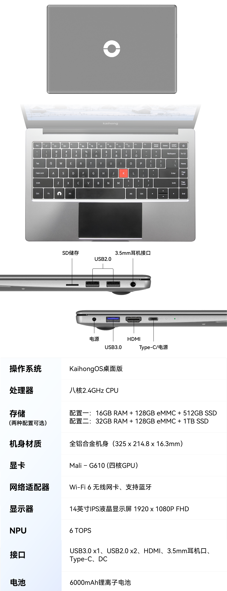
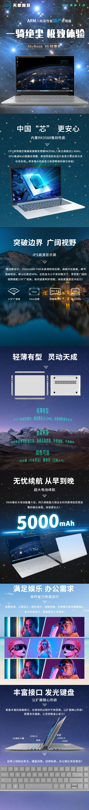

# RK3588 Laptop Skysi X5

RK3588笔记本电脑，来自ODM厂商深圳**天思智慧Skysi**，型号**X5**

市场上可找到的三款RK3588笔记本电脑：
- Coolpi CM5 Genbook，一款基于Coolpi CM5核心板的定制笔记本，Taobao有售
- [Lenovo RK3588 Laptop](https://github.com/bingo1991/RK3588_Lenovo_Laptop)，基于Slim7模具(小新Pro14、Yoga14S)打造的工程样机，只能淘于二手市场
- Skysi X5，完成度最高

人工手动逆向还原设备树源码，配合幽兰代码本官方内核正常启动使用。

## Skysi X5 可公开购买的两个定制版本，固件通刷
- 格蠹科技(Gedu)的幽兰代码本(Yourland CodeBook)，对硬件几乎没有定制
- 深开鸿(Kaihong)的BotBook，增加了32G+1TB版本，对A面LOGO及C面键盘均有定制

### [幽兰代码本](https://www.nanocode.cn/#/yl/bom)

### 开鸿BotBook
请访问[Kaihong官网获取](https://mall.kaihong.com/productDetail?skuId=1922672866491367425&goodsId=1922672866000633858)

### 天思智慧Skysi X5
[天思智慧Skysi X5](https://skysi.com.cn/en/product/p2/20220926/2784.aspx)

