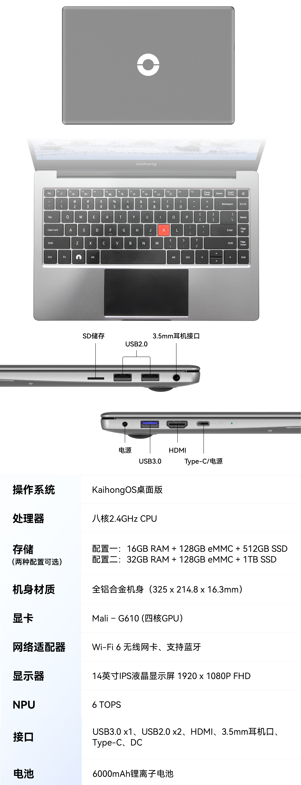
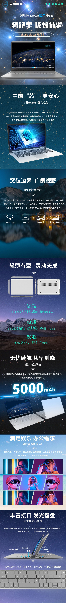

# RK3588 Laptop Skysi X5

RK3588笔记本电脑，来自ODM厂商深圳**天思智慧Skysi**，型号**X5**

市场上可找到的三款RK3588笔记本电脑：
- Coolpi CM5 Genbook，一款基于Coolpi CM5核心板的定制笔记本，Taobao有售
- [Lenovo RK3588 Laptop](https://github.com/bingo1991/RK3588_Lenovo_Laptop)，基于Slim7模具(小新Pro14、Yoga14S)打造的工程样机，只能淘于二手市场
- Skysi X5，完成度最高

人工手动逆向还原设备树源码，mainline Linux 7.0 内核基本可以正常启动使用。
- 修复了ES8326声卡
- SDIO WiFi兼容多型号板载网卡
- 修复了USB Type-C OTG/DP
- 优化了充电指示灯的显示逻辑
- 修复了USB OTG时误显示充电的问题

暂时存在如下的问题：
- USB Type-C口DP显示输出概率性链路训练成功，接扩展坞连HDMI时还有问题
- HDMI开机后热插入黑屏，插着HDMI线开机则没有问题，再拔插都行
- es7243e双麦克风阵列功能暂未验证
- 蓝牙暂时无法同时兼容多型号硬件

## Skysi X5 可公开购买的两个定制版本，固件**bascially**通刷
- 格蠹(Gedu)的幽兰代码本(Yourland)
- 深开鸿(Kaihong)的BotBook，增加32G+1TB版本，A面LOGO及C面键盘均有定制，硬件略有差异
  - 触控板设备在i2c4下，i2c地址为0x2c —— 开鸿刷幽兰的影响触控板会不可用
  - 蓝牙的 `BT,wake_host_irq` GPIO定义有区别
  - 没有SC89171充电管理芯片
  - USB Type-C的 fusb302 支持的PD充电规格不同

想同的配置:
- Power Supply: 12V DC and USB Type-C
- PMIC Solution: Dual RK806(Same with Lenovo RK3588)
- Type-C Solution: fusb302
- Charger: SouthChip SC8886 (Same with Lenovo RK3588, compatible with TI bq25703a)
- Battery: CW2017
- WiFi/BT：AP6275S or Fn-Link6252
  - WiFi(SDIO): bcm43752a or rtl8852bs
  - BT(UART1): bcm4362a2 or rtl8852bs-bt
- Audio: Dual-Mic, Speaker and 3.5mm Headphone
  - es8326, codec
  - es7243e, dual mic array ？

GPIO LED灯定制：
查询支持的trigger(cat /sys/devices/platform/gpio-leds/leds/battery_charging/trigger)：
- dc-charger-online
- bq257xx-charger-online
- cw2017-battery-charging-or-full
- cw2017-battery-charging
- cw2017-battery-full
- cw2017-battery-charging-blink-full-solid
- cw2017-battery-charging-orange-full-green

固化到armbian镜像，userpatches/overlay/etc/armbian-leds.conf

### [幽兰代码本](https://www.nanocode.cn/#/yl/bom)

### 开鸿BotBook
请访问[Kaihong官网获取](https://mall.kaihong.com/productDetail?skuId=1922672866491367425&goodsId=1922672866000633858)

### 天思智慧Skysi X5
[天思智慧Skysi X5](https://skysi.com.cn/en/product/p2/20220926/2784.aspx)

